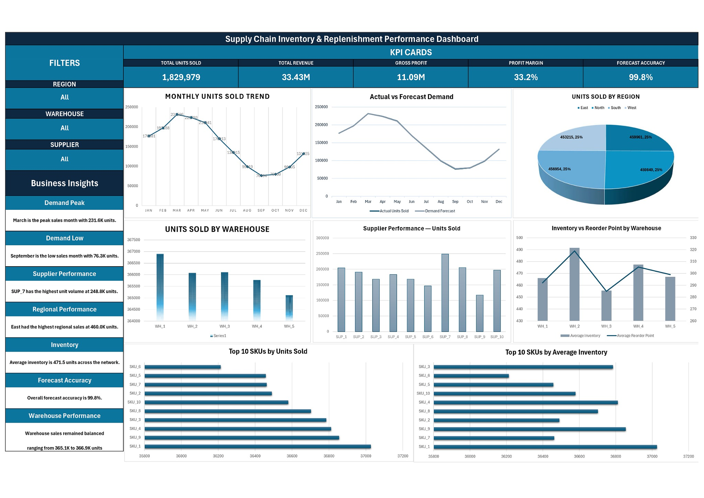

# Supply Chain Operations & Inventory Analytics

[](https://www.microsoft.com/en-us/microsoft-365/excel)
[](https://powerquery.microsoft.com/)
[](#dashboard)
[](https://github.com/Manipalsai/Supply-Chain-Operations-Inventory-Analytics)

An end-to-end **Supply Chain Business Intelligence and Analytics solution** built in **Microsoft Excel 2024**. This project demonstrates automated ETL pipelines via Power Query, robust analytical modeling, custom KPI architecture, dynamic array calculations, and a high-impact, interactive executive BI dashboard.

---

## Table of Contents
- [1. Project Overview](#1-project-overview)
- [2. Business Problem](#2-business-problem)
- [3. Project Objectives](#3-project-objectives)
- [4. Dataset](#4-dataset)
- [5. Dataset Structure](#5-dataset-structure)
- [6. Tools & Technologies](#6-tools--technologies)
- [7. Data Preparation & Power Query ETL](#7-data-preparation--power-query-etl)
- [8. Analytical Framework](#8-analytical-framework)
- [9. KPI Summary](#9-kpi-summary)
- [10. Interactive BI Dashboard](#10-interactive-bi-dashboard)
- [11. Analysis Performed](#11-analysis-performed)
- [12. Key Business Insights](#12-key-business-insights)
- [13. Business Recommendations](#13-business-recommendations)
- [14. Workbook Structure](#14-workbook-structure)
- [15. Project Workflow](#15-project-workflow)
- [16. Limitations](#16-limitations)
- [17. Future Improvements](#17-future-improvements)
- [18. Skills Demonstrated](#18-skills-demonstrated)
- [19. Author](#19-author)

---

## 1. Project Overview

Modern supply chain operations require continuous synchronization between commercial demand, supplier lead times, distribution capacity, and inventory replenishment thresholds. Suboptimal visibility leads to either costly inventory holding write-offs or stockout disruptions.

This project delivers a complete enterprise-grade analytics solution within **Microsoft Excel 2024**. By processing **91,251 transaction records** across 50 SKUs, 5 distribution warehouses, 10 suppliers, and 4 geographic markets, this solution provides supply chain leaders with real-time operational insights, inventory buffer tracking, and forecast accuracy monitoring.

---

## 2. Business Problem

Supply chain management teams face multi-faceted operational challenges:
- **Inventory & Carrying Cost Management:** Balancing stock availability without accumulating excessive on-hand inventory across regional hubs.
- **Supplier Lead Time Predictability:** Assessing vendor fulfillment reliability to prevent operational delays.
- **Demand Forecasting Variance:** Identifying gaps between projected demand and actual unit sales to prevent bullwhip effects.
- **Regional & Warehouse Allocation:** Ensuring uniform product distribution across multi-echelon warehouse networks.
- **Executive Visibility:** Transforming disjointed transactional records into an interactive, decision-ready BI dashboard.

---

## 3. Project Objectives

1. **Establish a Resilient ETL Pipeline:** Ingest, clean, validate, and transform 91,251 operational records using Excel Power Query.
2. **Develop Financial & Operational Metrics:** Calculate revenue, cost of goods sold, gross profit margins, forecast error, and inventory safety coverage.
3. **Perform Multi-Dimensional Business Analysis:** Evaluate trends across time (monthly seasonality), geography (4 regions), facilities (5 warehouses), vendors (10 suppliers), and products (50 SKUs).
4. **Engineer an Interactive Excel BI Dashboard:** Build a dynamic reporting interface driven by a dedicated calculation layer (`Dashboard_Data`), multi-criteria filtering (Region, Warehouse, Supplier), visual KPI cards, and trend charts.
5. **Formulate Actionable Strategies:** Translate analytical findings into concrete procurement, stocking, and replenishment recommendations.

---

## 4. Dataset

- **Dataset Name:** High-Dimensional Supply Chain Inventory Dataset
- **Source:** Kaggle (Authored by Ziya)
- **Direct Source Link:** [Dataset Documentation & Kaggle Link](Dataset/dataset_source.md)
- **Nature of Data:** Simulated, synthetic supply chain operational dataset created for analytics and modeling. *(Note: Not affiliated with or sourced from proprietary corporate databases).*
- **Scope:** Full calendar year 2024 (01-Jan-2024 to 31-Dec-2024).

---

## 5. Dataset Structure

| Column Name | Data Type | Role | Description |
| :--- | :--- | :--- | :--- |
| `Date` | Date | Attribute | Transaction date (01-Jan-2024 to 31-Dec-2024) |
| `SKU_ID` | Text | Dimension | Product identifier (50 unique SKUs: `SKU_1` – `SKU_50`) |
| `Warehouse_ID` | Text | Dimension | Regional distribution facility (`WH_1` – `WH_5`) |
| `Supplier_ID` | Text | Dimension | Vendor partner (`SUP_1` – `SUP_10`) |
| `Region` | Text | Dimension | Geographic market (`North`, `South`, `East`, `West`) |
| `Units_Sold` | Integer | Metric | Daily units sold per SKU / location |
| `Inventory_Level` | Integer | Metric | On-hand physical inventory units |
| `Supplier_Lead_Time_Days` | Integer | Metric | Vendor order turnaround time (in days) |
| `Reorder_Point` | Integer | Metric | Minimum threshold triggering replenishment orders |
| `Order_Quantity` | Integer | Metric | Volume of stock reordered from suppliers |
| `Unit_Cost` | Decimal ($) | Metric | Procurement acquisition cost per unit |
| `Unit_Price` | Decimal ($) | Metric | Commercial selling price per unit |
| `Promotion_Flag` | Binary | Attribute | `1` = Active promotion campaign; `0` = Standard pricing |
| `Stockout_Flag` | Binary | Attribute | *Audited as constant 0; excluded in Clean_Data to prevent bias* |
| `Demand_Forecast` | Decimal | Metric | Model-generated expected demand units |

*For complete field formulas and data definitions, see the [Data Dictionary](Documentation/Data_Dictionary.md).*

---

## 6. Tools & Technologies

- **Core Application:** Microsoft Excel 2024
- **ETL Engine:** Power Query (M-Code data transformations, type casting, formula injection)
- **Analytical Functions:** `SUMIFS`, `AVERAGEIFS`, `SUMPRODUCT`, `XLOOKUP`, `INDEX/MATCH`, `LET`, `LAMBDA`, Dynamic Arrays (`FILTER`, `SORT`, `UNIQUE`)
- **Reporting & Visuals:** Excel PivotTables, Pivot Charts, Custom KPI Cards, Conditional Formatting, Slicers & Dynamic Interactive Filter Bindings
- **Documentation:** Markdown & GitHub Pages architecture

---

## 7. Data Preparation & Power Query ETL

The raw dataset was ingested into an Excel Table named `Raw_Data` and transformed via Power Query using structured steps:

```
[Raw Data Ingestion] ──▶ [Type Enforcement] ──▶ [Null & Duplicate Audit] ──▶ [Calculated Field Generation] ──▶ [Clean_Data Output]
```

### Key Transformation Steps:
1. **Raw Ingestion & Archival:** Preserved original data untampered in `Raw_Data` (91,251 rows).
2. **Schema & Type Standardization:** Enforced explicit types for dates, text identifiers, integers, and currency values.
3. **Data Quality Audits:**
   - **Missing Values:** 0 null cells identified across all 91,251 records.
   - **Duplicate Records:** 0 duplicate composite key entries confirmed via `Duplicate_Check` sheet.
4. **Column Cleansing (`Stockout_Flag` Pruning):** `Stockout_Flag` contained exclusively constant `0` values. To prevent inaccurate conclusions, it was excluded from the cleaned model (`Clean_Data`). Stock risks were instead evaluated dynamically against `Inventory_Level` vs. `Reorder_Point`.
5. **Calculated Field Engineering (Power Query):**
   - **Revenue:** $\text{Units\_Sold} \times \text{Unit\_Price}$
   - **Cost:** $\text{Units\_Sold} \times \text{Unit\_Cost}$
   - **Forecast Variance:** $\text{Units\_Sold} - \text{Demand\_Forecast}$
   - **Absolute Forecast Error:** $|\text{Forecast\_Variance}|$
   - **Forecast Accuracy:** $1 - \left(\frac{\text{Absolute\_Forecast\_Error}}{\text{Units\_Sold}}\right)$ *(with division-by-zero safeguards)*

---

## 8. Analytical Framework

The analytical framework integrates operational supply chain indicators with financial performance metrics:

```
                                  ┌────────────────────────┐
                                  │ Supply Chain Analytics │
                                  └───────────┬────────────┘
         ┌───────────────────┬────────────────┼───────────────────┬───────────────────┐
         ▼                   ▼                ▼                   ▼                   ▼
  Demand & Sales        Financials       Procurement          Inventory          Forecasting
  - Units Sold          - Revenue        - Supplier Volume    - Avg Stock        - Actual vs Forecast
  - Monthly Trends      - COGS & Profit  - Lead Times         - Peak Stock       - Absolute Error
  - Regional Shares     - Margins (%)    - Order Quantities   - Reorder Buffer   - Accuracy Rate (%)
```

---

## 9. KPI Summary

Key performance indicators validated across the complete 2024 operational baseline:

| Key Performance Indicator (KPI) | Value / Metric | Business Assessment |
| :--- | :--- | :--- |
| **Total Transaction Records** | **91,251** | Comprehensive full-year operational depth |
| **Total Units Sold** | **1,829,979 Units** | Robust volume demand across 50 SKUs |
| **Total Revenue** | **$33,426,337.22** | Strong commercial top-line generation |
| **Total Cost (COGS)** | **$22,338,135.99** | Direct manufacturing & procurement expense |
| **Gross Profit** | **$11,088,201.23** | Healthy gross profitability |
| **Gross Profit Margin** | **33.2%** | Resilient profitability across product lines |
| **Average Inventory Level** | **471.5 Units** | Well-regulated average on-hand buffer |
| **Peak Inventory Observed** | **990 Units** | Warehouse capacity well within threshold limits |
| **Average Supplier Lead Time** | **8.0 Days** | Highly dependable vendor turnaround cycles |
| **Total Order Quantity** | **1,758,615 Units** | Replenishment closely synchronized with sales |
| **Overall Forecast Accuracy** | **99.8%** | High baseline demand forecast calibration |

---

## 10. Interactive BI Dashboard

The project features a **dynamic Excel Business Intelligence Dashboard** connected to an underlying dynamic helper/calculation sheet (`Dashboard_Data`).



### Core Dashboard Components:
1. **Interactive Slicers / Filters:** Multi-criteria filtering by **Region**, **Warehouse**, and **Supplier** with instantaneous cascade recalculation.
2. **Executive KPI Cards:** High-level summary of Units Sold, Total Revenue, Gross Profit, Average Inventory, and Lead Time.
3. **Monthly Demand Trend:** Visual breakdown of monthly sales volumes highlighting seasonal peaks and troughs.
4. **Actual vs. Forecast Demand:** Side-by-side comparison tracking demand estimation alignment over time.
5. **Regional Sales Distribution:** Comparative breakdown of unit sales across North, South, East, and West territories.
6. **Warehouse Fulfillment Distribution:** Operational volume balance across `WH_1` through `WH_5`.
7. **Supplier Performance Matrix:** Evaluation of vendor unit delivery volumes and lead time reliability.
8. **Inventory Level vs. Reorder Point:** Monitoring stock buffers against safety thresholds.
9. **Top 10 SKUs by Units Sold:** Ranking of highest revenue and unit volume drivers.
10. **Top 10 SKUs by Average Inventory:** Tracking stock concentration to prevent capital lockup.
11. **Embedded Business Insights Panel:** On-screen strategic summaries for operational decision-makers.

---

## 11. Analysis Performed

1. **Sales & Profitability Analysis:** Evaluated top-line revenue, cost structure, and gross margin health across all transaction layers.
2. **Temporal Demand & Seasonality:** Tracked monthly demand curves across the 12-month timeline.
3. **Geographic / Regional Analysis:** Evaluated regional revenue concentration and demand patterns across 4 territories.
4. **Warehouse Capacity & Load Balancing:** Measured volume throughput across 5 fulfillment centers.
5. **Supplier Vendor Analysis:** Analyzed supplier volume contributions and fulfillment lead times across 10 vendor partners.
6. **SKU-Level Portfolio Evaluation:** Analyzed unit sales, revenue share, and stock velocity for all 50 SKUs.
7. **Promotion Impact Analysis:** Assessed performance variance between standard pricing and active marketing promotions.
8. **Inventory Buffer & Safety Stock Analysis:** Evaluated inventory levels against predetermined reorder points.
9. **Forecast Variance & Accuracy Modeling:** Calculated absolute forecast error, error ratios, and model precision across all dimensions.

---

## 12. Key Business Insights

*For the complete detailed report, see [Business Insights](Documentation/Business_Insights.md).*

- **Seasonal Peak in March:** March recorded the annual high with **~231.6K units sold**, indicating strong Q1 replenishment and spring customer demand.
- **Trough in September:** Sales dipped to their lowest annual level in September at **~76.3K units**, revealing clear seasonal cyclicality.
- **Regional Market Leader:** The **East** region led overall volume at **~460.0K units**, though all four regions maintained strong market parity (24%–26% each).
- **Even Warehouse Distribution:** Fulfillment load was evenly balanced across facilities, ranging tightly between **365.1K and 366.9K units** across `WH_1`–`WH_5`.
- **Top Supplier Contribution:** **SUP_7** led all vendors in unit fulfillment with **~248.8K units**, while supplier lead times averaged a consistent **8.0 days**.
- **Healthy Buffer Management:** Average inventory stood at **471.5 units** against dynamic reorder thresholds, maintaining adequate stock buffers without extreme capital lockup.

---

## 13. Business Recommendations

1. **Seasonality-Adjusted Inventory Buffering:** Proactively ramp safety stock levels across regional warehouses starting in January to prepare for the March surge (~231.6K units), followed by inventory rationalization in August before the September slowdown (~76.3K units).
2. **Strategic Vendor Partnership Program:** Formalize Service Level Agreements (SLAs) with high-volume suppliers like `SUP_7` to lock in preferred pricing tiers and maintain lead times below 8 days.
3. **Targeted Regional Allocation:** Allocate incremental marketing campaigns and priority stock replenishment to the **East** region to capitalize on demonstrated volume demand.
4. **Continuous KPI Dashboard Reviews:** Integrate monthly reviews using the dynamic Excel BI dashboard to identify supplier lead-time anomalies and forecast deviations before they escalate into supply disruptions.

---

## 14. Workbook Structure

The Excel workbook [`Excel/Supply_Chain_Operations_Inventory_Analytics.xlsx`](Excel/Supply_Chain_Operations_Inventory_Analytics.xlsx) is structured into 15 organized worksheets:

```
Supply_Chain_Operations_Inventory_Analytics.xlsx
│
├── 1. Dashboard                  - Interactive Executive BI Dashboard
├── 2. Dashboard_Data             - Dynamic calculation and helper aggregation layer
├── 3. Region_Analysis            - Regional sales and volume breakdown
├── 4. Warehouse_Analysis         - Fulfillment facility capacity and throughput
├── 5. Supplier_Analysis          - Vendor lead times, volume, and order quantities
├── 6. SKU_Analysis               - Product-level sales, margin, and cost matrix
├── 7. Monthly_Analysis           - Seasonality and 12-month demand trends
├── 8. Promotion_Analysis         - Promotional campaign uplift and performance
├── 9. Inventory_Risk_Analysis    - Stock buffer, safety coverage, and reorder points
├── 10. Forecast_Analysis         - Actual vs forecast demand and accuracy metrics
├── 11. Business_Insights         - Structured summary of analytical findings
├── 12. Clean_Data                - Transformed analytical table output from Power Query
├── 13. KPI_Analysis              - Core KPI formulas, summaries, and baseline metrics
├── 14. Raw_Data                  - Untouched raw dataset table (91,251 rows)
└── 15. Duplicate_Check           - Data validation and integrity audit sheet
```

> **Note:** `KPI_Analysis` and `Duplicate_Check` are intentionally retained to provide full auditability of the data engineering and analytical validation workflows.

---

## 15. Project Workflow

```
┌────────────────────────────────────────────────────────┐
│                   Raw Dataset (CSV)                    │
│             91,251 rows | 15 raw attributes            │
└───────────────────────────┬────────────────────────────┘
                            │
                            ▼
┌────────────────────────────────────────────────────────┐
│                    Excel Raw_Data                      │
│             Structured Table Ingestion                 │
└───────────────────────────┬────────────────────────────┘
                            │
                            ▼
┌────────────────────────────────────────────────────────┐
│              Power Query / ETL Pipeline                │
│    Data Cleaning | Type Casting | Formula Creation     │
└───────────────────────────┬────────────────────────────┘
                            │
                            ▼
┌────────────────────────────────────────────────────────┐
│                      Clean_Data                        │
│          Clean Analytical Table for Modeling           │
└───────────────────────────┬────────────────────────────┘
                            │
                            ▼
┌────────────────────────────────────────────────────────┐
│                   Analytical Sheets                    │
│  PivotTables | SUMIFS | AVERAGEIFS | Dynamic Arrays    │
└───────────────────────────┬────────────────────────────┘
                            │
                            ▼
┌────────────────────────────────────────────────────────┐
│                    Dashboard_Data                      │
│        Dynamic Calculation & Slicer Helper Layer       │
└───────────────────────────┬────────────────────────────┘
                            │
                            ▼
┌────────────────────────────────────────────────────────┐
│               Interactive BI Dashboard                 │
│      Dynamic KPI Cards | Slicers | Visual Charts       │
└───────────────────────────┬────────────────────────────┘
                            │
                            ▼
┌────────────────────────────────────────────────────────┐
│             Business Insights & Decisions              │
│       Strategic Supply Chain Recommendations           │
└────────────────────────────────────────────────────────┘
```

---

## 16. Limitations

- **Simulated Dataset Characteristics:** The underlying dataset is synthetically generated, resulting in highly uniform distributions across warehouses and SKUs that may exhibit lower variance than real-world volatile logistics networks.
- **Static Inactive Stockout Flag:** The raw `Stockout_Flag` consisted of constant zero values and was pruned during ETL; stock risk was inferred from stock level vs. reorder point ratios.
- **Single-Year Horizon:** Covers 2024; multi-year historical data would enable deeper longitudinal trend and multi-year CAGR analysis.

---

## 17. Future Improvements

- **Power BI / Tableau Deployment:** Porting the analytical model to Power BI for DAX-powered time intelligence and automated web-service refreshes.
- **SQL Data Pipeline:** Migrating raw transactional ingestion to PostgreSQL/Snowflake for enterprise scalability.
- **Advanced Machine Learning Forecasting:** Implementing ARIMA/Prophet demand forecasting models in Python to benchmark against baseline forecasts.
- **Safety Stock Optimization:** Developing automated Economic Order Quantity (EOQ) and dynamic safety stock algorithms factoring in lead time variability.

---

## 18. Skills Demonstrated

- **Business Intelligence & Reporting:** Executive BI Dashboard Architecture, Dynamic Helper Layers, Interactive Slicers, Visual Hierarchy Design.
- **Advanced Excel Analytics:** Excel Tables, PivotTables, `SUMIFS`, `AVERAGEIFS`, `SUMPRODUCT`, `INDEX/MATCH`, `XLOOKUP`, Dynamic Arrays (`FILTER`, `SORT`, `UNIQUE`).
- **ETL & Data Transformation:** Microsoft Power Query, M-Code basics, Data Type Validation, Data Cleansing, Deduplication Auditing.
- **Supply Chain Analytics:** Inventory Turnover, Buffer Sizing, Reorder Point Analysis, Supplier Lead Time Tracking, Demand Forecasting Variance.
- **Financial & Operational Modeling:** Unit Economics, Revenue & COGS Computation, Margin Analysis, Forecast Accuracy Optimization.

---

## 19. Author

**Manipalsai**
- **GitHub:** [@Manipalsai](https://github.com/Manipalsai)
- **Project Repository:** [Supply-Chain-Operations-Inventory-Analytics](https://github.com/Manipalsai/Supply-Chain-Operations-Inventory-Analytics)

---
*If you find this project helpful or insightful, please consider giving it a ⭐ on GitHub!*
